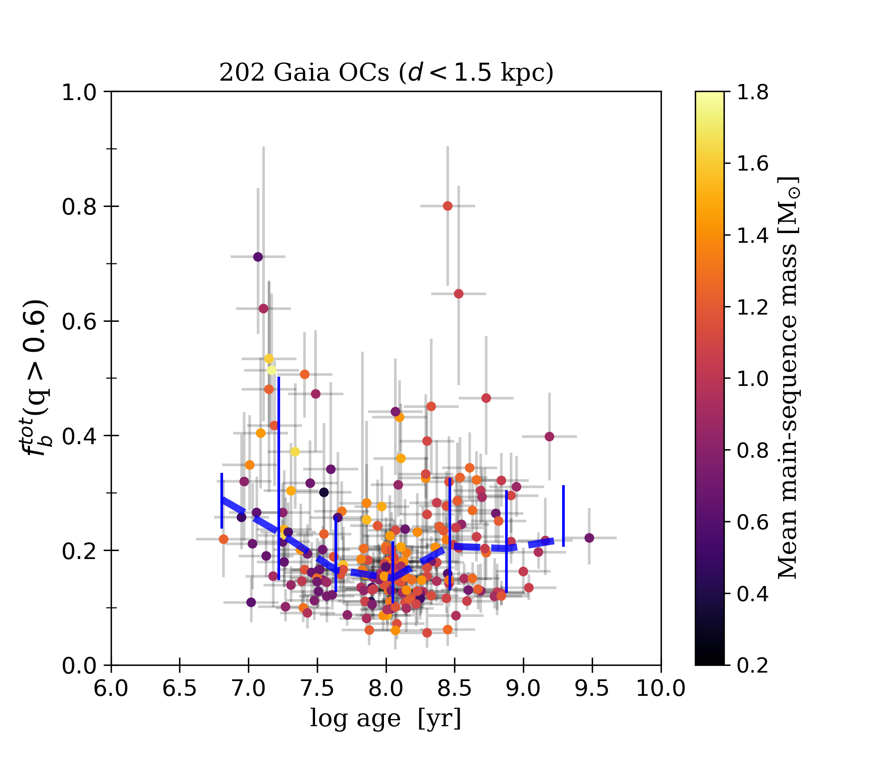

# The binary fraction in open clusters with Gaia

This repository contains the source code that reproduces the figures in [Donada et al. (2023)](arXiv link here).

The notebooks are structured as follows:

* [plot_cmd_cut_example.ipynb](plot_cmd_cut_example.ipynb): Shows how we select the main-sequence members of the Gaia OCs. Reproduces Fig. 2 in our paper.
* [compute_binaryfraction.ipynb](compute_binaryfraction.ipynb): Demonstrates how to run our mixture model with emcee on the Gaia colour-magnitude diagrams of open-cluster main sequences. Reproduces Figs. 3 and 4 in our paper. 
* [compute_total_binaryfraction.ipynb](compute_total_binaryfraction.ipynb): Shows how we correct the obtained binary fractions for resolved binaries. Reproduces Fig. 7 in our paper. 
* [simulated_cmd_ngc6494.ipynb](simulated_cmd_ngc6494.ipynb): Shows a simulated CMD of an OC (showing example results obtained with the Gaia Object Generator). Reproduces Fig. 5 in our paper.
* [binary_fraction_analysis.ipynb](binary_fraction_analysis.ipynb): Reproduces most of the analysis figures in our paper (Figs. 1, 6, 9-13)
* [literature_comparison.ipynb](literature_comparison.ipynb): Comparison to some results from the literature. Reproduces Fig. 8 in our paper.
